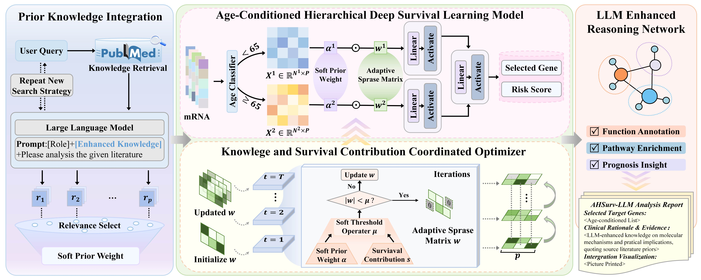

# AHSurv-LLM: An age-conditioned hierarchical deep survival learning framework with LLM-enhanced knowledge for lung adenocarcinoma prognosis

## Overview
Lung adenocarcinoma (LUAD) exhibits substantial heterogeneity in survival outcomes, while the prognostic relevance of gene expression may vary across age groups. At the same time, existing deep survival models mainly learn from molecular profiles and observed survival outcomes, making limited use of external biomedical knowledge and providing insufficient biological interpretability.

**AHSurv-LLM** is an age-conditioned hierarchical deep survival learning framework that integrates LLM-enhanced biomedical knowledge with transcriptomic survival modeling. The framework incorporates literature-derived gene–prognosis evidence as computable soft prior weights, captures both age-specific and shared prognostic patterns through a hierarchical survival architecture, and adaptively regulates gene sparsity according to both biological prior support and sustained survival contributions. An LLM-based reasoning procedure is further used to connect model-selected prognostic genes with potential biological functions and pathways.

## Key Features
- **LLM-enhanced knowledge integration:** automatically extracts gene–survival evidence from biomedical literature and converts the evidence into continuous soft prior weights that can be incorporated into survival model learning.

- **Age-conditioned hierarchical survival learning:** models younger and older patients through age-specific representation layers followed by a shared representation layer, allowing the framework to capture heterogeneous as well as common prognostic patterns across age groups.
  
- **Knowledge and survival contribution coordinated adaptive sparse optimization:** jointly considers LLM-derived biological priors and dynamically accumulated gene-level survival contributions to adapt the strength of sparsity constraints during model optimization.
  
- **LLM-assisted biological interpretation:** uses LLM reasoning to annotate selected prognostic genes, associate them with relevant pathways, and consolidate them into higher-level biological processes, providing a link between model-derived prognostic signals and potential biological mechanisms.
  
- **Survival prediction and prognostic gene identification:** simultaneously supports patient-level risk prediction and sparse prognostic gene selection, with performance assessed using C-index, Kaplan–Meier analysis, and time-dependent AUC across independent LUAD cohorts.

## Framework
The overall architecture of AHSurv-LLM is illustrated below.

## Data Availability
**UCSC Xena TCGA-LUAD dataset:**

Gene Expression RNAseq-STAR-TPM: https://xenabrowser.net/datapages/?dataset=TCGA-LUAD.star_tpm.tsv&host=https%3A%2F%2Fgdc.xenahubs.net&removeHub=https%3A%2F%2Fxena.treehouse.gi.ucsc.edu%3A443

Survival Data: https://xenabrowser.net/datapages/?dataset=TCGA-LUAD.survival.tsv&host=https%3A%2F%2Fgdc.xenahubs.net&removeHub=https%3A%2F%2Fxena.treehouse.gi.ucsc.edu%3A443

**GEO datasets:**

GSE30219: https://www.ncbi.nlm.nih.gov/geo/query/acc.cgi?acc=GSE30219

GES31320: https://www.ncbi.nlm.nih.gov/geo/query/acc.cgi?acc=GSE31210

GSE50081: https://www.ncbi.nlm.nih.gov/geo/query/acc.cgi?acc=GSE50081

GSE37745: https://www.ncbi.nlm.nih.gov/geo/query/acc.cgi?acc=GSE37725

GSE68465: https://www.ncbi.nlm.nih.gov/geo/query/acc.cgi?acc=GSE68465

GSE72094: https://www.ncbi.nlm.nih.gov/geo/query/acc.cgi?acc=GSE72094

## Requirements
|  Key Requirements | Version |
|-------|------|
| `Python` | 3.12.10 |
| `torch` | 2.13.0 |
| `numpy` | 2.5.1 |
| `pandas` | 2.3.3 |
| `scikit-learn` | 1.9.0 |
| `matplotlib` | 3.11.1 |
| `openai` | 2.32.0 |
| `biopython` | 1.87 |

## Contact

The manuscript associated with this project is currently under review. Citation information will be added after publication.

Questions about the project may be directed to the corresponding author listed in the manuscript.

